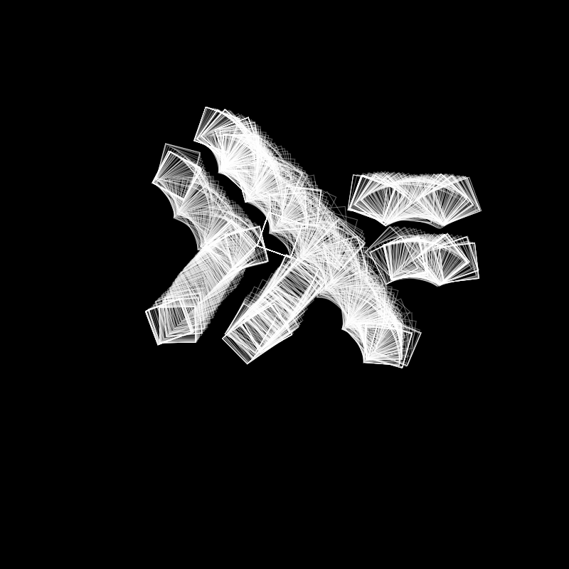

# Draw Squares

A simple demo drawing application using p5.js.
[Try Here](https://aravindvasudev.github.io/code-dump/drawSquares/)

## Instructions
  * Left click and move the mouse across the canvas to draw.

  * Press `Esc` key to save

## Screenshot

