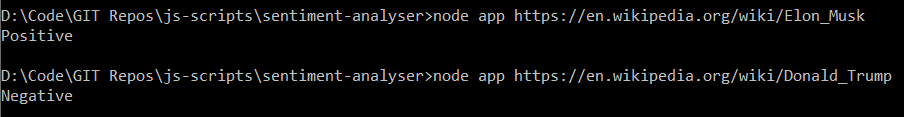

# sentiment-analyser
A demo application that performs sentiment analysis(NLTK) on text extracted from a given link, preferably wikipedia using sentiment.js.

# Demo

# Running the Program
* INPUT
  * Pass the URL as a command-line argument.

* OUTPUT
  * Positive / Negative
