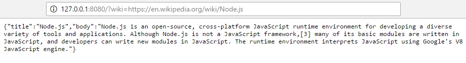
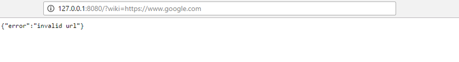

# wiki-scrapper
A simple Wikipedia Scrapper that returns a JSON scrapped from Wikipedia.

# Demo

# Running the Program
* INPUT
  * The URL should be passed as a query string inside url parameter

* OUTPUT
  * The output contains three parameter: title, body and error
    * 'title' contains the title of the document
    * 'body' contains the first paragraph of text
    * 'error' parameter is added whenever something goes wrong
